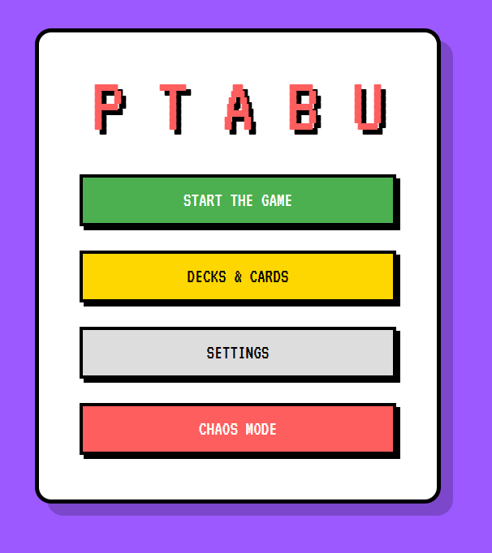
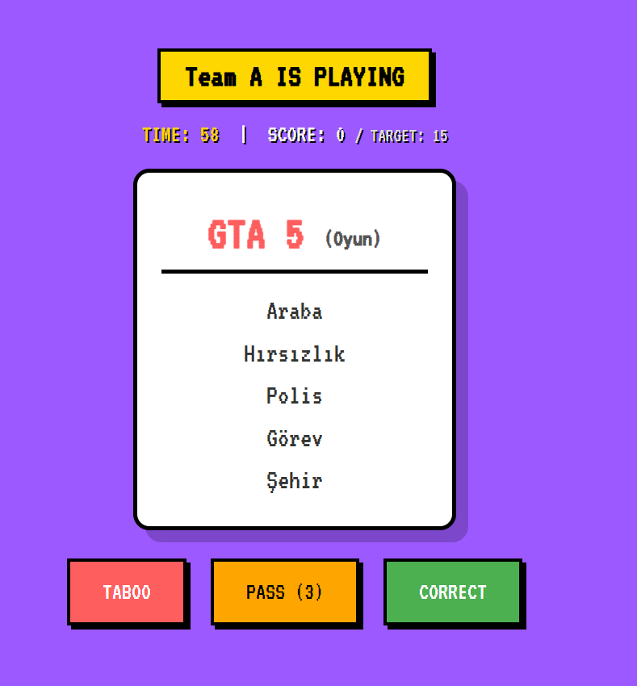

# 🎮 Pixel Art Multiplayer Taboo Game

This project is a team-based, pixel art-themed Taboo (word-guessing) game developed using C# and ASP.NET Core MVC.

## 🚀 Features
* **Team-Based Gameplay:** A turn-based scoring system designed for two teams.
* **Customizable Deck:** A dynamic database structure allowing users to add custom target and forbidden words.
* **Tag System:** Categorization of words (e.g., Anime, Games, Science).
* **Pixel Art UI/UX:** A retro-themed user interface and sound effects built with HTML, CSS, and JavaScript.

## 📸 Screenshots

### Home Page

### In-Game View

## 🛠️ Technologies Used
* **Backend:** C#, ASP.NET Core MVC
* **Database:** Microsoft SQL Server
* **Frontend:** HTML5, CSS3, JavaScript
